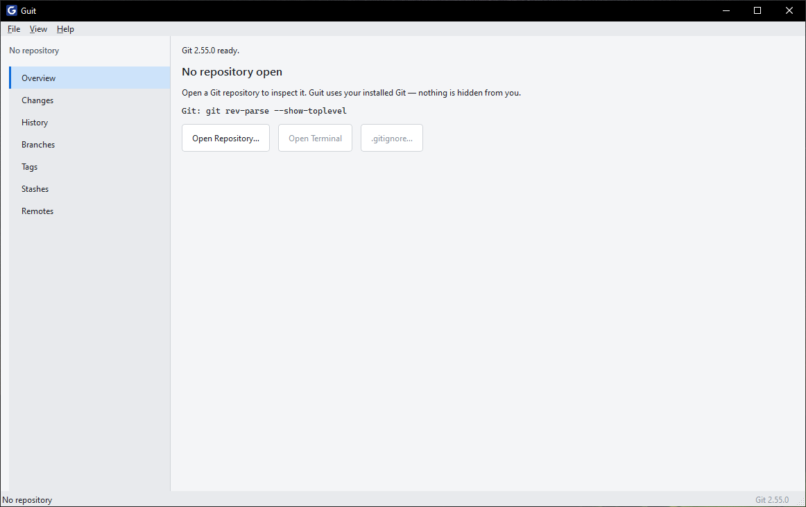
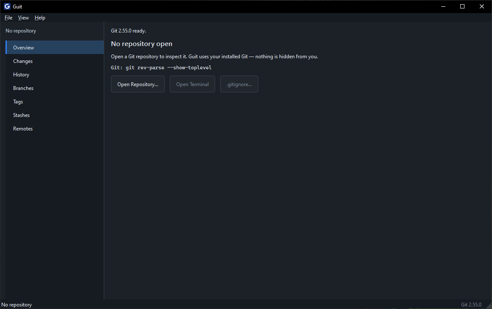

# Guit

A modern, beginner-friendly desktop Git client written in C++ and Qt 6.

Guit makes Git easier to use and understand **without hiding Git itself**. For important operations, Guit shows you the exact Git command it runs, so you learn Git while using it.

## Features

- **Repository Management** – Open, initialize, clone repositories
- **Changes** – Stage/unstage files, view diffs, commit with amend support
- **History** – Browse commit history with search, view commit details and diffs
- **Branches** – Create, switch, rename, delete branches; compare branches
- **Tags** – Create annotated/lightweight tags, push tags
- **Stashes** – Create, apply, pop, drop stashes
- **Remotes** – Add/remove remotes, fetch, pull, push
- **Merge/Rebase** – Merge branches, rebase with conflict resolution
- **Reset/Revert/Cherry-pick** – Full support with conflict handling
- **Submodules** – Initialize, update, sync
- **Worktrees** – Manage multiple working trees
- **Git LFS** – Track large files
- **Gitignore Helper** – Edit `.gitignore` with presets
- **Reflog** – Browse reflog for recovery
- **Git Graph** – Visual commit graph with branch lines
- **Command Log** – Every Git command executed is logged for transparency

## Screenshots

| Light Theme | Dark Theme |
|-------------|------------|
|  |  |

## Requirements

- Windows 10/11 (primary target)
- Git for Windows (must be installed separately)

## Installation

Guit provides three distribution formats:

| Format | File | Use Case |
|--------|------|----------|
| **Windows Installer** | `Guit-<version>-windows-x64-Setup.exe` | Recommended for most users. Installs to Program Files, creates Start Menu shortcut, optional desktop shortcut, includes uninstaller. |
| **Portable Package** | `Guit-<version>-windows-x64.zip` | For users who prefer no installation. Extract anywhere and run. |
| **Raw Build Artifact** | `build-release/src/guit.exe` | **Not for distribution.** Internal build output — missing Qt/MinGW runtime DLLs. |

### Windows Installer (Recommended)
1. Download `Guit-<version>-windows-x64-Setup.exe`
2. Run the installer
3. Follow the wizard (chooses Start Menu shortcut, optional desktop icon)
4. Launch from Start Menu → Guit

### Portable Package
1. Download `Guit-<version>-windows-x64.zip`
2. Extract to any folder
3. Run `guit.exe`

> **⚠️ Do not use** `build-release/src/guit.exe` directly — it lacks required Qt/MinGW runtime DLLs and will not run outside the build environment.

## Building from Source

### Requirements
- CMake 3.21+
- Ninja
- MinGW-w64 (GCC 13+)
- Qt 6.5+ (MinGW build)
- Git for Windows

### Build Steps
```bash
# Configure
cmake -S . -B build -G Ninja -DCMAKE_BUILD_TYPE=Release

# Build
cmake --build build

# Run tests
ctest --test-dir build --output-on-failure

# Deploy (creates build/deploy/ with all dependencies)
cmake --build build --target deploy

# Create portable package
cmake --build build --target package
```

## Usage

### Opening a Repository
- File → Open Repository
- Drag a folder onto the window
- Command line: `guit.exe /path/to/repo`

### Key Workflows
- **Stage changes**: Select files → Stage (Ctrl+Enter to commit)
- **View history**: History tab shows commit graph with search
- **Branches**: Create/switch/merge/rebase from Branches tab
- **Remotes**: Fetch/Pull/Push from Remotes tab
- **Conflicts**: Resolve in Changes tab with "Use Ours"/"Use Theirs"

### Keyboard Shortcuts
| Shortcut | Action |
|----------|--------|
| Ctrl+O | Open Repository |
| Ctrl+R | Refresh |
| Alt+1..7 | Switch tabs (Overview, Changes, History, Branches, Tags, Stashes, Remotes) |
| Ctrl+T | Open Terminal |
| Ctrl+Q | Quit |
| F5 | Refresh |
| Ctrl+Enter | Commit (in Changes) |

## Configuration

Settings are stored in the system registry (Windows) or config files (Linux/macOS):
- Theme: System / Light / Dark
- Git executable path (auto-detected)
- Beginner/Advanced mode
- Notification preferences

## Transparency

Guit's core philosophy: **Make Git easier to use and understand without hiding Git itself.**

For every important operation, Guit shows the equivalent Git command in the status bar and command log. You always know what Git is doing.

Example:
```
Created branch "feature/login"
Git: git switch -c feature/login
```

## License

GPL License - see [LICENSE](LICENSE) file for details.

## Contributing

See [CONTRIBUTING.md](CONTRIBUTING.md) for guidelines.

## Security

See [SECURITY.md](SECURITY.md) for reporting vulnerabilities.

## Acknowledgments

- Qt 6 framework
- Git for Windows
- All contributors
